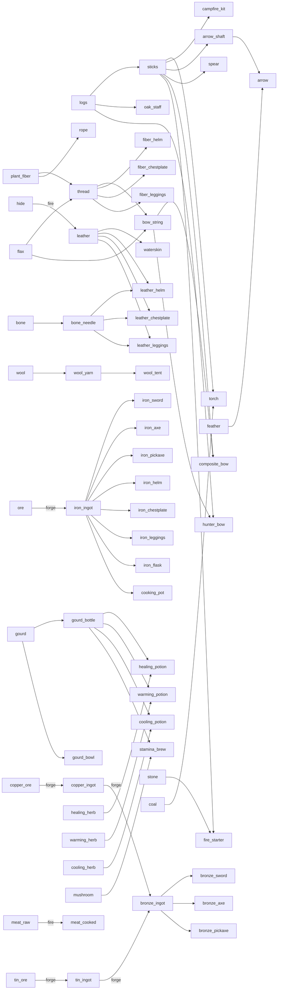

# MATERIAL_TREE.md — Interconnected Crafting Tree

Full crafting graph for the ~87-item registry introduced in Phase E. Item ids match the plan's Phase E list exactly. The six pre-existing recipes (oak_staff, iron_axe, iron_pickaxe, iron_sword, hunter_bow, meal) are retained and extended with station requirements.

---

## 1. Raw Sources

### 1.1 Plants

| Item id | Name | Grows in | Primary uses |
|---|---|---|---|
| plant_fiber | Plant Fiber | Plains, forest, jungle | Thread, rope, fiber armor, campfire_kit |
| flax | Flax | Plains (riverside) | Thread, bow_string |
| reeds | Reeds | River banks | Arrow shafts, rope |
| gourd | Gourd | Desert edges, jungle | gourd_bottle, gourd_bowl |
| cactus_flesh | Cactus Flesh | Desert | Food (cooling, minor heal), edible raw |
| healing_herb | Healing Herb | Forest, plains | healing_potion, direct-consume heal |
| warming_herb | Warming Herb | Alpine / mountain_forest | warming_potion |
| cooling_herb | Cooling Herb | Jungle | cooling_potion |
| mushroom | Mushroom | Dense forest, cave entrances | stamina_dish ingredient |
| berries | Berries | Forest, plains | meal (existing recipe), edible raw |

### 1.2 Trees and Mining

| Item id | Name | Source | Notes |
|---|---|---|---|
| logs | Logs | Any tree (axe: 3 hits) | Existing item |
| stone | Stone | Stone nodes (pickaxe) | Existing item |
| coal | Coal | Coal seams (pickaxe) | Fuel for torch, forge |
| copper_ore | Copper Ore | Copper veins (pickaxe) | Plains / hills |
| tin_ore | Tin Ore | Tin veins (pickaxe) | Plains / hills |
| ore | Iron Ore | Iron veins (pickaxe) | Existing item; mid-biome and deeper |

### 1.3 Animals

Drop tables by species (see Phase J):

| Animal species | Drops |
|---|---|
| Deer | hide, meat_raw, bone |
| Rabbit | hide, meat_raw |
| Bird | feather, egg |
| Cow | hide, meat_raw |
| Horse | — (owned; no drop while alive) |
| Donkey | — (owned; no drop while alive) |
| Dragon | dragon_scale |
| Griffin | griffin_feather |
| Sea serpent | — (aquatic; drops TBD Phase J) |

Wool source: sheep-equivalent animal drops wool when sheared (or on kill); wool is a direct gather drop in Phase J.

| Item id | Source |
|---|---|
| hide | Deer, rabbit, cow (kill drop) |
| wool | Sheep-type animal (shear or kill drop) |
| feather | Bird (kill drop) |
| bone | Deer (kill drop) |
| meat_raw | Deer, rabbit, cow, bird (kill drop) |
| egg | Bird (nest scatter / periodic drop) |
| dragon_scale | Dragon (kill drop) |
| griffin_feather | Griffin (kill drop) |

### 1.4 Water

| Source | Item / effect | Notes |
|---|---|---|
| River (fresh water) | Drink directly (E key) or fill container | Restores thirst fully |
| Sea water | No drink option | Excluded from fill; causes illness if consumed |

---

## 2. Processed Materials

All recipes below yield one output unit unless noted. Station column uses: **H** = hand, **F** = fire, **G** = forge.

| Output id | Output name | Inputs | Station | Qty out | Notes |
|---|---|---|---|---|---|
| sticks | Sticks | logs × 1 | H | 4 | Core crafting intermediate |
| planks | Planks | logs × 1 | H | 4 | Shelter / structural |
| thread | Thread | plant_fiber × 2 OR flax × 1 | H | 1 | Armor, containers, strings |
| bow_string | Bow String | thread × 2 OR flax × 2 | H | 1 | Bows, composite_bow |
| rope | Rope | plant_fiber × 4 OR reeds × 3 | H | 1 | Climbing aids, tent rigging |
| arrow_shaft | Arrow Shaft | reeds × 1 OR sticks × 1 | H | 4 | Arrow component |
| bone_needle | Bone Needle | bone × 1 | H | 1 | Required for leather armor |
| wool_yarn | Wool Yarn | wool × 2 | H | 1 | Wool tent, wool armor |
| leather | Leather | hide × 1 | F | 1 | Tanning over fire; armor, containers |
| copper_ingot | Copper Ingot | copper_ore × 1 | G | 1 | Bronze alloy input |
| tin_ingot | Tin Ingot | tin_ore × 1 | G | 1 | Bronze alloy input |
| bronze_ingot | Bronze Ingot | copper_ingot × 1 + tin_ingot × 1 | G | 1 | RS-style alloy |
| iron_ingot | Iron Ingot | ore × 1 | G | 1 | Mid-tier gate |

---

## 3. Products

### 3.1 Tools

| Item id | Inputs | Station | Notes |
|---|---|---|---|
| sticks | logs × 1 | H | 4 sticks out |
| fire_starter | sticks × 2 + stone × 1 | H | Lights campfire_kit or loose logs |
| torch | sticks × 1 + coal × 1 | H | 4 out; held torch +0.3 warmth |
| campfire_kit | logs × 3 + sticks × 3 + stone × 1 | H | Placeable; becomes lit campfire |
| bronze_axe | bronze_ingot × 2 + sticks × 2 | G | Existing spawn-kit item, now forge-gated |
| bronze_pickaxe | bronze_ingot × 2 + sticks × 2 | G | Existing spawn-kit item, now forge-gated |
| iron_axe | iron_ingot × 2 + sticks × 2 | G | Was hand-crafted; now forge-gated |
| iron_pickaxe | iron_ingot × 2 + sticks × 2 | G | Was hand-crafted; now forge-gated |
| oak_staff | logs × 3 | H | Existing recipe; reduces climb drain 20→14/s |

### 3.2 Containers

| Item id | Inputs | Station | Capacity / effect |
|---|---|---|---|
| gourd_bottle | gourd × 1 | H | Holds 1 drink (quench 60) |
| gourd_bowl | gourd × 1 + sticks × 1 | H | Cooking bowl for dishes at fire |
| waterskin | leather × 1 + thread × 2 | H | Holds 1 drink (quench 100) |
| iron_flask | iron_ingot × 2 | G | Holds 2 drinks (quench 100 each) |
| cooking_pot | iron_ingot × 3 | G | Enables fire+pot station recipes |

### 3.3 Weapons

| Item id | Inputs | Station | Notes |
|---|---|---|---|
| stone | stone × 1 | H | Throwable (simple arc projectile) |
| spear | sticks × 3 + stone × 2 | H | Reach weapon |
| bronze_sword | bronze_ingot × 3 + sticks × 1 | G | Early metal melee |
| iron_sword | iron_ingot × 3 + sticks × 1 | G | Existing item; now forge-gated |
| arrow | arrow_shaft × 4 + feather × 1 | H | Ammunition for bows; 4 out |
| hunter_bow | logs × 2 + bow_string × 1 | H | Existing item; recipe updated |
| composite_bow | sticks × 4 + bow_string × 2 + feather × 2 | H | Higher damage than hunter_bow |

### 3.4 Armor (3 slots: head / body / legs)

Defense values per slot shown as head / body / legs. Warmth is the `totalWarmth` contribution (used in temperature max-not-sum calc).

#### Fiber tier (defense 1 / 1 / 1, warmth +0.2 per piece)

| Item id | Inputs | Station |
|---|---|---|
| fiber_helm | plant_fiber × 4 + thread × 2 | H |
| fiber_chestplate | plant_fiber × 8 + thread × 4 | H |
| fiber_leggings | plant_fiber × 6 + thread × 3 | H |

#### Leather tier (defense 2 / 3 / 2, warmth +0.4 per piece)

| Item id | Inputs | Station |
|---|---|---|
| leather_helm | leather × 2 + thread × 2 + bone_needle × 1 | F |
| leather_chestplate | leather × 5 + thread × 4 + bone_needle × 1 | F |
| leather_leggings | leather × 4 + thread × 3 + bone_needle × 1 | F |

#### Iron tier (defense 4 / 6 / 4, warmth +0.1 per piece — metal is cold)

| Item id | Inputs | Station | Notes |
|---|---|---|---|
| iron_helm | iron_ingot × 3 | G | Raises lightning-strike odds (BOTW nod) |
| iron_chestplate | iron_ingot × 6 | G | Raises lightning-strike odds |
| iron_leggings | iron_ingot × 5 | G | Raises lightning-strike odds |

Damage reduction: ≈ 4 % per defense point (applied inside `damagePlayer`).

### 3.5 Shelter

Tents are placeable items consumed from inventory. Warmth contribution is additive to the temperature system (capped by max-not-sum rule when combining with other warmth sources of the same category).

| Item id | Inputs | Station | Warmth | Notes |
|---|---|---|---|---|
| fiber_tent | plant_fiber × 12 + rope × 2 | H | +0.5 | Rain shelter; lowest tier |
| wool_tent | wool_yarn × 8 + rope × 3 + sticks × 4 | H | +0.8 | Better insulation |
| hide_tent | leather × 6 + rope × 4 + sticks × 4 | H | +1.1 | Best warmth; rain + wind block |

### 3.6 Food and Potions

All fire recipes require being near a lit campfire. Pot recipes additionally require `cooking_pot` in inventory. EffectClass determines how effects interact (one class per dish; mixing classes cancels).

| Item id | Inputs | Station | EffectClass | Effect |
|---|---|---|---|---|
| meat_cooked | meat_raw × 1 | F | — | edible: heal 6 HP |
| berry_meal (meal) | berries × 5 | H | — | edible: heal 2 HP (existing recipe) |
| mushroom_stew | mushroom × 2 + gourd_bowl × 1 | F+pot | stamina | Restores 40 stamina |
| warming_dish | warming_herb × 2 + meat_raw × 1 | F+pot | warm | Temperature +1.5 for 180 s |
| cooling_dish | cooling_herb × 2 + cactus_flesh × 1 | F+pot | cool | Temperature −1.5 for 180 s |
| hearty_stew | meat_raw × 2 + mushroom × 1 + healing_herb × 1 | F+pot | heal | Heal 12 HP |
| healing_potion | healing_herb × 3 + gourd_bottle × 1 | F | heal | Heal 8 HP; drinkable |
| warming_potion | warming_herb × 3 + gourd_bottle × 1 | F | warm | Temperature +1.0 for 120 s; drinkable |
| cooling_potion | cooling_herb × 3 + gourd_bottle × 1 | F | cool | Temperature −1.0 for 120 s; drinkable |
| stamina_brew | mushroom × 2 + gourd_bottle × 1 | F | stamina | Restore 60 stamina; drinkable |

---

## 4. Dependency Diagram

Key production chains rendered as a simplified directed graph.

```
Raw                  Processed             Products
───                  ─────────             ────────

logs ──────────────→ sticks ────────────→ torch, campfire_kit, arrow, spear
     │               planks
     └──────────────────────────────────→ oak_staff

copper_ore ─────────→ copper_ingot ─┐
                                    ├──→ bronze_ingot ──→ bronze_sword
tin_ore ────────────→ tin_ingot ────┘                     bronze_axe
                                                          bronze_pickaxe

ore ────────────────→ iron_ingot ──────→ iron_sword, iron_axe, iron_pickaxe
                                         iron_helm/chestplate/leggings
                                         iron_flask, cooking_pot

hide ───────────────→ leather ─────────→ waterskin
     (fire)                              leather_helm/chestplate/leggings
                                         leather_potion base

plant_fiber ────────→ thread ──────────→ bow_string ──→ hunter_bow
            │                                           composite_bow
            └───────────────────────────────────────→ fiber armor, rope

flax ───────────────→ thread / bow_string (alternate path)

reeds / sticks ─────→ arrow_shaft ────→ arrow (+ feather)

bone ───────────────→ bone_needle ────→ leather armor (required)

wool ───────────────→ wool_yarn ───────→ wool_tent

healing_herb ───────────────────────── healing_potion (fire + gourd_bottle)
warming_herb ───────────────────────── warming_potion / warming_dish
cooling_herb ───────────────────────── cooling_potion / cooling_dish
mushroom ───────────────────────────── mushroom_stew / stamina_brew

gourd ──────────────→ gourd_bottle ───→ potions (input container)
      └─────────────→ gourd_bowl ─────→ dishes (fire+pot station)

sticks + coal ──────→ torch
fire_starter + logs → campfire (lit)   ← enables F station
campfire + stone ───→ forge            ← enables G station
forge + cooking_pot (in inv) ──────────→ F+pot recipes unlocked
```

Mermaid form of the major chains (for tooling that renders it):



---

## 5. Progression Summary

### Day 1 — Bare hands only (hand station)

The player spawns with a fire_starter in the spawn kit. Without any crafting station, they can make:

| Unlock | How |
|---|---|
| sticks | Punch a tree → logs → sticks |
| plant_fiber | Gather from plains/forest |
| thread | plant_fiber × 2 |
| rope | plant_fiber × 4 |
| fiber_tent | plant_fiber × 12 + rope × 2 |
| fire_starter | sticks × 2 + stone (or use spawn kit one) |
| campfire_kit | logs × 3 + sticks × 3 + stone |
| gourd_bottle | Gourd from jungle/desert edge |
| fiber armor | plant_fiber + thread (def 1/1/1, warmth +0.2) |
| berry_meal | berries × 5 |
| spear | sticks × 3 + stone × 2 |
| stone (throwable) | stone × 1 |

**Goal:** Stay warm, have water (gourd_bottle from river), basic shelter.

### After fire station unlocks

Placing a campfire_kit (or using fire_starter on logs) opens the fire station:

| Unlock | How |
|---|---|
| leather | hide × 1 @fire |
| meat_cooked | meat_raw × 1 @fire (kills deer/rabbit/cow first) |
| leather armor | leather + thread + bone_needle @fire |
| waterskin | leather + thread (better than gourd_bottle) |
| potions | healing/warming/cooling herbs + gourd_bottle @fire |

**Goal:** Upgrade to leather armor, sustain HP with cooked food and potions.

### After forge unlocks

Building a forge (campfire + stone) opens the forge station. Requires sourcing copper_ore + tin_ore or iron ore:

| Unlock | How |
|---|---|
| bronze_ingot | copper_ingot + tin_ingot |
| bronze_axe / pickaxe | bronze_ingot + sticks |
| bronze_sword | bronze_ingot × 3 |
| iron_ingot | ore @forge |
| iron tools | iron_ingot + sticks |
| iron armor | iron_ingot @forge (def 4/6/4) |
| iron_flask | iron_ingot × 2 (2-drink container) |
| cooking_pot | iron_ingot × 3 (unlocks F+pot recipes) |

**Goal:** Iron armor and tools, cooking_pot for hearty stews and stamina brews for mountain expeditions.

### Cooking pot bonus recipes (fire + cooking_pot in inventory)

| Recipe | Benefit |
|---|---|
| mushroom_stew | Stamina restore (mountain climbing) |
| warming_dish | Survive alpine/night cold |
| cooling_dish | Survive desert heat |
| hearty_stew | Large heal (12 HP) |

---

## Appendix: Item id master list (Phase E additions)

Items marked * exist in the pre-Phase-E codebase. All others are new Phase E additions.

```
Plants / gathered
  plant_fiber, flax, reeds, gourd, cactus_flesh
  healing_herb *, warming_herb, cooling_herb, mushroom
  berries *, logs *, stone *, ore *

Mining
  coal, copper_ore, tin_ore

Animal drops
  hide, wool, feather, bone, meat_raw, egg
  dragon_scale, griffin_feather

Processed materials
  sticks, planks, thread, bow_string, rope, arrow_shaft
  bone_needle, wool_yarn, leather
  copper_ingot, tin_ingot, bronze_ingot, iron_ingot

Containers
  gourd_bottle, gourd_bowl, waterskin, iron_flask, cooking_pot

Fire / shelter
  fire_starter, torch, campfire_kit
  fiber_tent, wool_tent, hide_tent

Tools
  bronze_axe *, bronze_pickaxe *, iron_axe *, iron_pickaxe *, oak_staff *

Weapons
  stone, spear, bronze_sword
  iron_sword *, hunter_bow *
  arrow, composite_bow

Armor (head / body / legs)
  fiber_helm, fiber_chestplate, fiber_leggings
  leather_helm, leather_chestplate, leather_leggings
  iron_helm, iron_chestplate, iron_leggings

Food / potions
  meat_cooked, meal * (berry_meal)
  mushroom_stew, warming_dish, cooling_dish, hearty_stew
  healing_potion, warming_potion, cooling_potion, stamina_brew

Loot / misc
  gold_small *, gold_large *, ancient_relic *
  torch_oil *, old_bone *, rusty_key *
```
